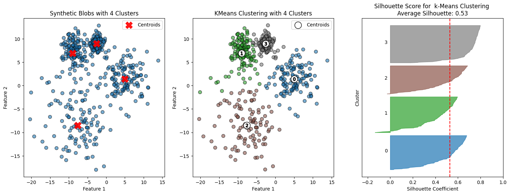
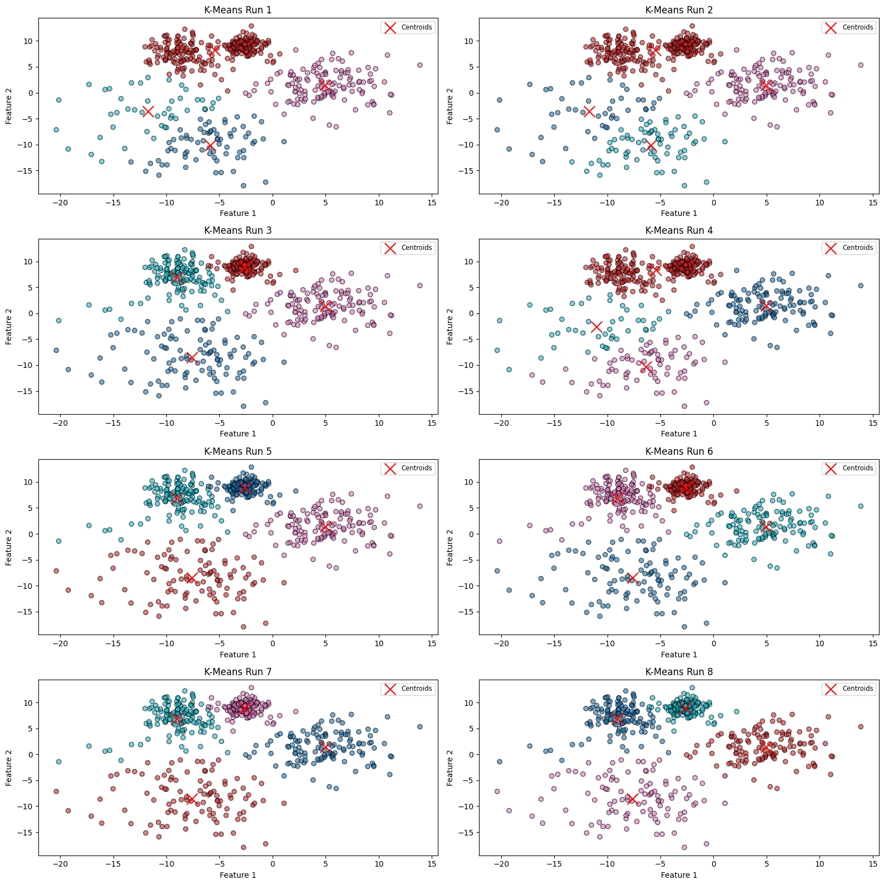
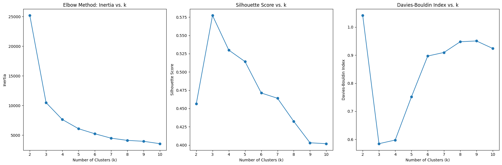
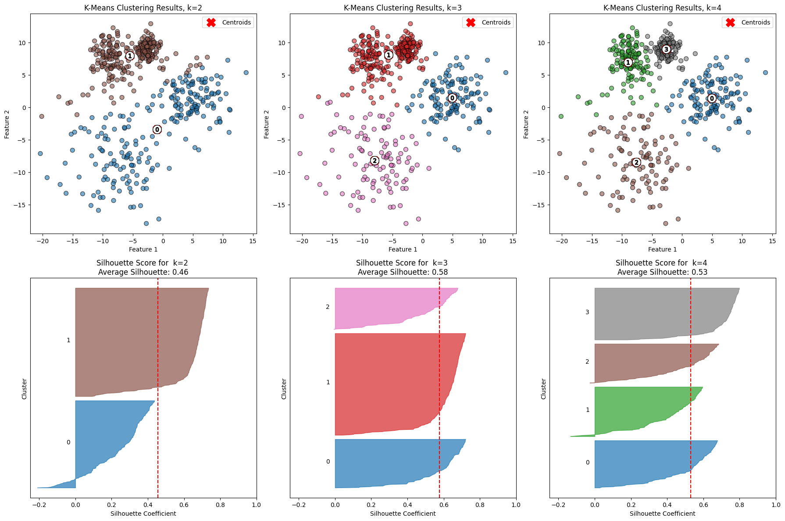
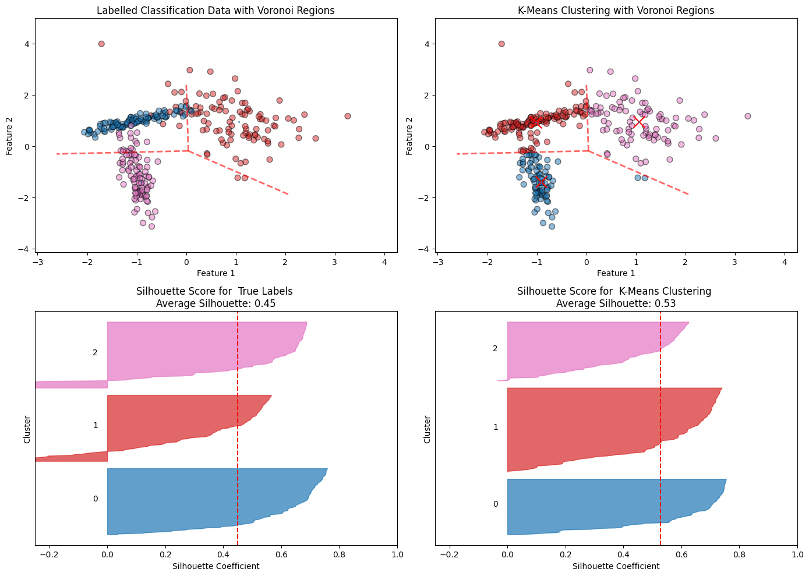

# Evaluating K-Means Clustering

This project studies how to evaluate K-means clustering using synthetic 2D datasets, cluster quality metrics, repeated runs, and visual comparisons. The notebook focuses on four main questions:

1. How well does K-means separate blob-like data?
2. How stable is K-means across different random initializations?
3. How does the choice of k affect clustering quality?
4. Where does K-means fail because of shape assumptions?

## Files / figures used in this repo

- `data.png`
- `cluster-stability.png`
- `increase-clusters.png`
- `different-k.png`
- `shape-sensitivity.png`

## Main idea

K-means tries to divide data into k groups by assigning each point to the nearest centroid, then updating each centroid to be the mean of the points assigned to it. This process repeats until the assignments stop changing much.

In plain math, K-means minimizes:

J = sum over all clusters i of sum over all points x in cluster i of ||x - mu_i||^2

where:

- `mu_i` is the centroid of cluster `i`
- `||x - mu_i||^2` is the squared Euclidean distance from point `x` to its assigned centroid

So the algorithm is trying to make points as close as possible to their assigned centers.

## Metrics used

### Inertia

Inertia is the total within-cluster squared distance:

Inertia = sum of ||x - mu_assigned||^2 over all points

Lower inertia means tighter clusters, but inertia almost always decreases as k increases, so it should not be used alone.

### Silhouette score

For one point:

s = (b - a) / max(a, b)

where:

- `a` = average distance from the point to other points in its own cluster
- `b` = average distance from the point to the nearest different cluster

Interpretation:

- close to `1`: well-clustered
- close to `0`: near a cluster boundary
- below `0`: possibly assigned to the wrong cluster

### Davies-Bouldin index

This compares how spread out each cluster is relative to how far clusters are from each other. Lower values are better. A lower Davies-Bouldin index usually means compact clusters with better separation.

## Technical workflow in the notebook

The notebook does the following:

- installs and imports `numpy`, `pandas`, `matplotlib`, `scikit-learn`, and `scipy`
- generates synthetic blob data using `make_blobs`
- fits K-means using `sklearn.cluster.KMeans`
- computes:
  - `silhouette_score`
  - `silhouette_samples`
  - `davies_bouldin_score`
- builds a custom `evaluate_clustering(...)` function to draw silhouette plots
- repeats K-means several times to inspect initialization sensitivity
- compares metric values across different choices of `k`
- creates a second synthetic dataset with `make_classification`
- visualizes Voronoi boundaries to show why K-means struggles with non-spherical shapes

## Notebook content

### Evaluate a clustering model

Evaluate a clustering model using silhouette scores and the Davies-Bouldin index.

Parameters:  
X (ndarray): Feature matrix.  
labels (array-like): Cluster labels assigned to each sample.  
n_clusters (int): The number of clusters in the model.  
ax: The subplot axes to plot on.  
title_suffix (str): Optional suffix for plot titlec

Returns:  
None: Displays silhoutte scores and a silhouette plot.

This is implemented as a reusable helper function that computes the average silhouette score, computes sample-level silhouette values, and draws the silhouette blocks cluster by cluster.

---

### Creating data with four blobs

Creating data with four blobs

The notebook first builds a synthetic dataset with 500 points, 2 features, and 4 centers. The cluster spreads are intentionally different:

- one tighter cluster
- one moderate cluster
- one wider cluster
- one medium cluster

This is useful because K-means often behaves differently when cluster densities are uneven.

### Interpretation

In a silhouette plot, every sample is assigned a value between -1 and 1 that reflects how well it fits within its cluster. Values closer to 1 suggest the point is grouped appropriately, since it is much closer to members of its own cluster than to points in nearby clusters. When the value is around 0, the point lies near the separation between clusters. Values below 0 suggest the assignment may be questionable, and the point could belong more naturally to a different cluster. We will examine the silhouette plot in more detail later.

The clustering outcome looks fairly reasonable, especially since in this synthetic dataset we already know there are four underlying blobs. In a real setting, though, that kind of prior knowledge would usually not be available, so judging the quality of the clustering would be less straightforward.

---

## Cluster stability

### Cluster stability

One way to study how sensitive K-means is to its starting conditions is to run it several times with different randomly chosen initial centroids and then compare the outcomes.

A useful quantity for this is inertia, which reflects how tightly the points are grouped around their assigned cluster centers. More precisely, it is the total squared distance from each observation to its centroid. Smaller inertia generally means the clusters are more compact, which can suggest a better fit. Still, inertia almost always drops when more clusters are added, so it should not be judged in isolation.

To check clustering stability, we can avoid fixing the random seed and repeat K-means across multiple initializations. This lets us see whether changing the starting centroid locations leads to noticeably different results. If the inertia values and cluster assignments stay similar from run to run, that suggests the clustering is stable and not heavily driven by the initial centroid placement.

The code runs K-means multiple times with `random_state=None`, stores the inertia values, and plots each clustering result in a subplot grid.

### Interpretation

As demonstrated by the clustering results above, the cluster assignments vary between runs when using different initial centroid seeds. Additionally, the inertia values show inconsistency, indicating that the clustering process is sensitive to the initial placement of centroids. This inertial inconsistency implies an less reliable result.

---

## Increase number of clusters

### Increase number of clusters

To explore the effects of number of clusters, we can examine how varying the value of K affects key metrics such as inertia, the Davies-Bouldin index, and silhouette scores. By plotting these scores as a function of K, we can analyze the results and potentially gain insights into the optimal number of clusters for our data.

The notebook evaluates `k = 2` through `k = 10` and plots:

- inertia vs. k
- silhouette score vs. k
- Davies-Bouldin index vs. k

### Interpretation

The first plot is often used in the 'elbow method,' where the ideal value of k is chosen near the point where the curve starts to level off. Since inertia decreases as the number of clusters increases, it’s important to find the balance where adding more clusters provides diminishing returns in reducing inertia.  
The inertia plot points to an optimal cluster number around 3 or 4. The silhouette score shows a clear peak at k = 3, while the Davies-Bouldin index reaches its lowest values between k = 3 and k = 4.

Overall, these metrics suggest that three clusters may be optimal, although we know that the true number of clusters in this case is actually four.

---

## Comparing different values of k directly

The notebook then visualizes the actual clustering result and silhouette plot for several values of `k`, allowing metric-based conclusions to be compared against visual structure.

### Interpretation

By examining the clustering results for k = 2, 3, and 4, it becomes apparent that the intuitive choice for the optimal number of clusters is four, although one could also argue for three. For k=3, the first cluster fails to distinguish between two regions with varying densities, whereas for k=4, these regions are split into two distinct clusters (clusters 1 and 3).

The silhouette plot for k=4 shows relatively uniform block widths across clusters, suggesting clusters of similar sizes. However, the shape of these blocks indicates that many points are somewhat ambiguously assigned, highlighting that the clusters are not distinctly separated and may overlap to some extent.

Determining the 'correct' number of clusters is not straightforward, as it often involves subjective judgment. Metrics alone point to k=3 as being optimal, given that the silhouette plot for k=3 shows better cluster separation, with higher and more consistent silhouette scores across clusters compared to other choices for k.

---

## Shape sensitivity

### Shape sensitivity

Identifying where K-means will not be appropriate.

The final section creates a classification-style synthetic dataset with 3 classes and applies K-means with `k = 3`. It also draws Voronoi regions from the learned centroids. This helps show a core limitation of K-means:

K-means partitions space by nearest centroid distance, so its boundaries are Voronoi boundaries. That means it naturally prefers compact, roughly spherical clusters and can struggle when the real structure is elongated, curved, or density-based.

### Interpretation

K-means did a good job of identifying three clusters that mostly agree with the three classses.  
However, looking at the finer details, k-means wasn't able to fully capture the inherent coherence of the two linearly shaped classes (purple and green).

Another thing to notice is that the clusters are partitioned in a way that doesn't capture the density of the classes.

The red dashed lines in the scatter plots indicate the boundaries between the "voronoi" regions that separate the clusters. This partitioning method inherently assumes spherical cluster shapes and can misclassify points where the true distribution is curved or linear. For instance, a few points belonging to the elongated purple class were mislabelled, falling into the bottom section of the more spherical cluster. Similarly, the green points between the two green and purple clusters were mislabeled.

Interestingly, the silhoutte score is higher for the clustering result than it it for the actual class labels. This is appropriate though since the actual classes slightly overlap, as is also indicated by the negative values in the silhoutte plot for the pink and red classes.

In real world clustering problems, we do not have the benefit of knowing the answer like we did in this experiment, so we will need to be creative.The K-means algorithm performed reasonably well in identifying three clusters that mostly align with the true class labels. However, a closer examination reveals that K-means struggles to accurately capture the elongated, linear structure of the two classes (represented in purple and green).

One notable limitation is that K-means does not effectively account for the density distribution of points. The resulting clusters are separated by "Voronoi" boundaries (indicated by the red dashed lines), which split the space into regions that are equidistant to the nearest centroids. This approach inherently assumes spherical shapes for clusters and can misclassify points if the true distribution deviates from this assumption.

Similarly, some green points situated between the main green and purple clusters were also labeled incorrectly. This highlights K-means' inability to fully respect the density-based continuity of data.

A more flexible clustering approach, such as DBSCAN (Density-Based Spatial Clustering of Applications with Noise), might be more suitable for this type of data. DBSCAN takes density into account and can identify clusters of varying shapes and sizes, potentially capturing the true structure of the data more effectively.

In real-world clustering tasks, the ground truth is not known, so exploring multiple algorithms and adapting them to the specific data characteristics is essential. Testing different methods like DBSCAN or hierarchical clustering, which consider density and proximity in non-linear ways, could provide better results for complex datasets.

---

## Final analysis

This notebook shows that evaluating K-means should never rely on a single metric.

Main takeaways:

- K-means works reasonably well on blob-like data
- silhouette score and Davies-Bouldin index are useful, but they can disagree with visual intuition
- inertia alone is not enough because it decreases as k grows
- changing initialization can change the result, so stability matters
- K-means can miss the true structure when clusters are elongated, overlapping, or density-shaped
- visual inspection is still important, especially when the true labels are unknown

Overall, the notebook gives a practical demonstration that clustering quality depends both on metric values and on whether the assumptions of the algorithm match the geometry of the data.
